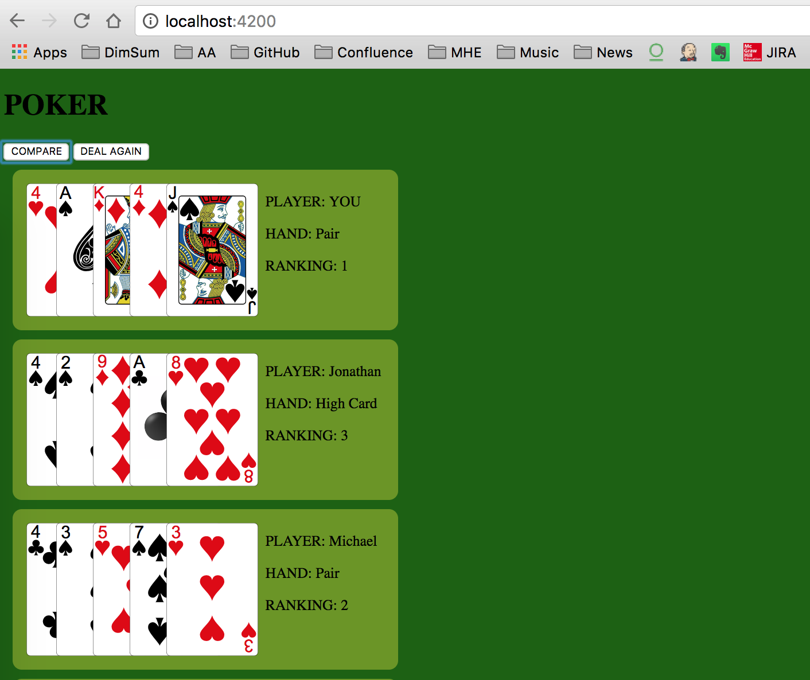
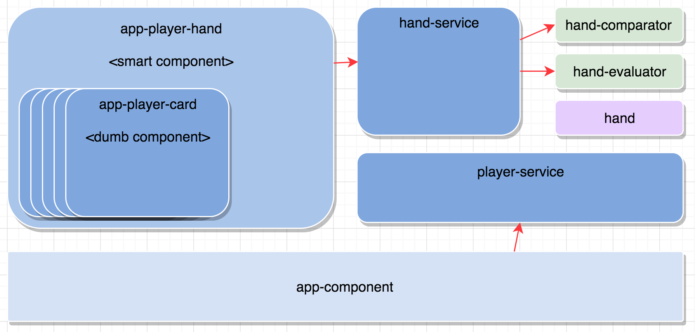

# Poker Exercise




##Arcitecture



## Data Model

### Hand

Hand(): `new Hand([...])`

- cards;
- handName;
- playerName;
- playerRanking;
- kickers;
- highCardValue;

### Card

string: `(rank)(suit)`

- Suits: `'S','C','D','H'`
- Ranks: `2,3,4,5,6,7,8,9,10,J,Q,K,A`


### Cards/Deck

string[ ]: `['AS','10D','KC',...]`

- 52 Card Deck


## Running Locally

###Prerequisites:

- npm (tested at 3.10.10
- angular-cli (install by running `npm i g @angular/cli@latest`)


###Running
Run `ng serve` for a dev server. Navigate to `http://localhost:4200/`. The app will automatically reload if you change any of the source files.


## Notes for Interviewer

```
#1. Write a function that takes a 5-card hand as a JSON array and determines its category, with any tie breaking information that is necessary.  For example, the input  ["JH", "4C", "4S", "JC", "9H"] would have the value of two pair: jacks and 4s with a 9 kicker. You may choose your own representation for the output.
```
**Note: see hand-evaluator.ts for implementation: 'evaluate()' method.**

```
#2. Write a function that takes 2 or more 5-card hands and determines the winner.
```
**Note: see hand-comparator.ts for implementation: 'evaluateGame()' method. Winner is the player with 'RANKING: 1'**

```
#3. Some poker variations use more than 5 cards per player, and the player chooses the best subset of 5 cards to play. Write a function that takes 5 or more cards and returns the best 5-card hand that can be made with those cards.  For example, the input ["3H", "7S", "3S", "QD", "AH", "3D", "4S"] should return [“3H”, “3S”, “3D”, “AH”, “QD”], which is a 3-of-a-kind with 3s, ace and queen kickers.
```
**Note: To change number of cards, goto 'app.component.ts' and change   private numberOfCards = 5; to number of cards**

## Running unit tests

Run `ng test` to execute the unit tests. 

